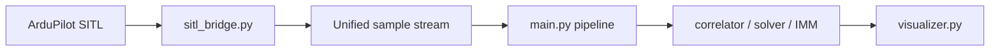

# TERRAIN NAVIGATOR Implementation Guide

## Purpose

This document is a single handoff file for another Codex session or a second developer.
It explains:

- what the project already contains;
- what the target demo must show;
- how to split the remaining work between 2 people;
- how to integrate ArduPilot SITL in the most practical way;
- how to visualize GNSS loss and terrain-based correction clearly for judges;
- how to keep both parts easy to merge at the end.

The goal is not only to have working code, but to present a convincing live demo:

1. the aircraft starts with GNSS available;
2. GNSS is intentionally disabled during flight;
3. the system continues estimating position using terrain matching;
4. the UI clearly shows that terrain-based correction becomes active immediately;
5. the final trajectory is shown over the DEM map together with correlation heatmaps and motion estimates.

---

## Project Status

The repository already contains the core TERRAIN NAVIGATOR modules:

- `sim_generator.py`
- `nmea_parser.py`
- `dem_loader.py`
- `profile_extractor.py`
- `correlator.py`
- `position_solver.py`
- `imm_filter.py`
- `visualizer.py`
- `main.py`
- `integration_test.py`

There is also:

- `README.md`
- `pytest.ini`
- unit tests for all major modules

Current state:

- the pipeline works end-to-end;
- simulation/replay and visualization already exist;
- the project can build terrain profiles and run correlation;
- visualization already shows the navigation process;
- tests pass locally;
- the next practical step is live/demo integration with `ArduPilot SITL`.

Important honesty point:

- the current integration test is an end-to-end smoke test;
- it proves pipeline stability and report generation;
- it does not yet prove final competition-grade accuracy in all conditions.

For the jury demo, this is acceptable if we present it as an MVP with a working terrain-aided navigation loop.

---

## Required Functional Story

The final demo should show all of the following requirements in a coherent flow:

1. Convert radar altimeter data into an absolute terrain-height profile along the flight path.
2. Build reference profiles from the DEM for all directions from `0` to `360` degrees with `1` degree step.
3. Search for the best azimuth and offset by maximizing correlation.
4. Estimate the motion vector:
   - speed in meters per second;
   - course angle / azimuth;
   - ground track velocity.
5. Visualize the result:
   - heatmap of correlation scores across directions;
   - estimated trajectory over the terrain map.
6. Demonstrate GNSS loss and immediate transition to terrain-based correction.

The GNSS-loss scenario is the strongest demonstration element and should be treated as a first-class feature, not as a side detail.

---

## Core Navigation Logic

### Terrain Profile Recovery

For each sample:

```python
terrain_height_m = altitude_msl - radar_alt_m
```

Where:

- `altitude_msl` is absolute altitude above mean sea level;
- `radar_alt_m` is altitude above local terrain;
- `terrain_height_m` is the recovered terrain height directly under the aircraft.

Over a moving window, this becomes the measured terrain profile.

### Reference Profiles

From a candidate map position, generate DEM-based profiles for many azimuths:

- azimuth range: `0..359` degrees;
- step: `1 degree`;
- length: depends on the correlation window and allowed offset.

### Correlation Search

For each azimuth and offset:

- compare measured terrain profile with DEM reference profile;
- compute correlation score;
- choose the peak:
  - `best_azimuth_deg`
  - `best_offset_m`
  - `correlation_peak`

### Motion Vector Estimation

The system should expose:

- `estimated_speed_mps`
- `estimated_heading_deg`
- `estimated position`

This can come from correlation + smoothing/filtering already implemented in:

- `position_solver.py`
- `imm_filter.py`

---

## Demo Scenario For Judges

The most persuasive live scenario is:

### Phase 1: Normal Flight

- SITL is running;
- aircraft follows a mission over non-flat terrain;
- GNSS is shown as available;
- truth position and estimated position are both visible;
- terrain navigator is also running in parallel.

### Phase 2: GNSS Loss

At a chosen time:

- GNSS is disabled or ignored;
- UI status changes to:
  - `GNSS LOST`
  - `TERRAIN NAVIGATION ACTIVE`
- estimated position continues updating from terrain matching.

### Phase 3: Terrain-Based Correction

The UI should show:

- measured terrain profile;
- correlation heatmap;
- current best azimuth and offset;
- continued estimated movement on the map;
- truth trajectory for comparison.

### Phase 4: Optional GNSS Return

If time allows:

- GNSS is enabled again;
- the system shows convergence or cross-check against truth.

This part is optional, but useful if we want to show resilience and re-synchronization.

---

## Best Practical SITL Integration Strategy

The most practical approach is:

1. run `ArduPilot SITL`;
2. connect to it from Python through `pymavlink`;
3. read truth/navigation telemetry;
4. derive synthetic `radar_alt_m` using our DEM;
5. feed a unified sample stream into the existing navigation pipeline;
6. use a simple flag/timer to emulate GNSS availability.

This is better than trying to deeply modify ArduPilot internals in the first iteration.

### Why This Approach

Because it gives us:

- a realistic moving aircraft source;
- live telemetry timing;
- a controllable GNSS loss demo;
- minimal risk compared to writing back into autopilot estimation immediately.

It also allows us to build and test the bridge first as a read-only integration.

---

## Unified Data Contract

This contract must be frozen early so both developers can work independently.

### Input Sample

Every producer must output samples in this format:

```python
sample = {
    "timestamp": float,
    "lat": float,
    "lon": float,
    "alt_msl": float,
    "heading_deg": float,
    "ground_speed_mps": float,
    "radar_alt_m": float,
    "gnss_available": bool
}
```

Rules:

- `lat`, `lon`: WGS84 degrees;
- `alt_msl`: meters above mean sea level;
- `heading_deg`: `0..360`;
- `ground_speed_mps`: meters per second;
- `radar_alt_m`: meters above terrain;
- `timestamp`: float seconds;
- `gnss_available`: whether GNSS may be trusted in this sample.

### Navigator Output

The terrain navigation pipeline should return:

```python
result = {
    "estimated_lat": float,
    "estimated_lon": float,
    "estimated_heading_deg": float,
    "estimated_speed_mps": float,
    "best_azimuth_deg": float,
    "best_offset_m": float,
    "correlation_peak": float,
    "mode": str,
    "heatmap": object
}
```

Where:

- `mode` is typically `GNSS` or `TERRAIN`;
- `heatmap` can be any internal structure that the visualizer understands.

If both sides respect this contract, merging is straightforward.

---

## Split Between 2 People

The cleanest split is by subsystem, not by random files.

## Person 1: SITL / MAVLink / GNSS Demo

### Responsibility

This person owns the live data source and the GNSS loss scenario.

### Files

Primary files:

- `sitl_bridge.py` (new)
- optionally `test_sitl_bridge.py`
- small README additions if needed

Possible small integration changes:

- a narrow entrypoint hook in `main.py`

### Main Tasks

1. Connect to `ArduPilot SITL` over MAVLink.
2. Read telemetry:
   - position;
   - altitude;
   - heading;
   - speed.
3. Generate `radar_alt_m` from DEM and truth altitude.
4. Implement `gnss_available` toggling:
   - by timer;
   - or by manual switch;
   - or both.
5. Emit samples in the unified format.

### Recommended Installation

Needed software:

- `Python 3.10+`
- `git`
- `pymavlink`
- `ArduPilot SITL`
- optional `Mission Planner` or `MAVProxy`

### What To Ask Codex

Good prompts for this person:

- `Create sitl_bridge.py that reads MAVLink from udp:127.0.0.1:14550 and emits unified samples.`
- `Add a GNSS drop timer after 30 seconds in sitl_bridge.py.`
- `Add a mock mode for sitl_bridge.py so the bridge can be tested without real SITL.`
- `Write test_sitl_bridge.py for parsing and sample formatting logic.`
- `Update README.md with SITL launch instructions only.`

### Deliverable

This person is done when:

- the bridge connects to SITL;
- samples flow continuously;
- GNSS availability can change during runtime;
- the output format matches the contract exactly.

---

## Person 2: Terrain Engine / Visualizer / Demo UX

### Responsibility

This person owns the navigation output and all jury-facing visualization.

### Files

Primary files:

- `main.py`
- `visualizer.py`

Possible support files:

- `correlator.py`
- `position_solver.py`
- `imm_filter.py`

### Main Tasks

1. Accept unified `sample` input from the bridge.
2. Build measured terrain profile from:
   - `alt_msl - radar_alt_m`
3. Run correlation over azimuths and offsets.
4. Estimate position and motion vector.
5. Render:
   - truth trajectory;
   - estimated trajectory;
   - DEM map;
   - correlation heatmap;
   - mode indicator;
   - GNSS availability indicator.

### What To Ask Codex

Good prompts for this person:

- `Add --sitl mode to main.py and wire unified samples into the pipeline.`
- `Extend visualizer.py to show GNSS ON/OFF and TERRAIN ACTIVE statuses.`
- `Plot truth trajectory and estimated trajectory together on the DEM map.`
- `Render a live correlation heatmap by azimuth and offset.`
- `Add a visible event marker at the moment GNSS becomes unavailable.`

### Deliverable

This person is done when:

- bridge samples can be consumed directly;
- terrain mode is visible and understandable;
- the jury can see what the algorithm is doing without reading code.

---

## Merge Plan

Integration should happen through one narrow orchestration layer.

### Recommended Flow



### Practical Merge Order

1. Freeze the `sample` format.
2. Person 1 finalizes the bridge output.
3. Person 2 consumes that exact structure.
4. Add one `--sitl` mode to `main.py`.
5. Run a short mission.
6. Trigger GNSS loss.
7. Verify live visualization.

### Avoiding Merge Conflicts

Recommended branches:

- `feature/sitl-bridge`
- `feature/terrain-visual-demo`

Try to avoid both people editing large sections of `main.py` at the same time.
If needed:

- Person 1 creates a separate source adapter module;
- Person 2 only integrates the adapter after the bridge stabilizes.

---

## Visualization Requirements

The UI must clearly tell a story even to a non-technical jury member.

### Required Panels

1. Terrain map panel
   - DEM background
   - truth trajectory
   - estimated trajectory
   - current aircraft marker

2. Correlation heatmap panel
   - azimuth on one axis
   - offset or window shift on the other
   - peak highlighted

3. Terrain profile panel
   - measured terrain profile
   - best reference profile
   - visual overlap

4. System state panel
   - GNSS status
   - mode (`GNSS` / `TERRAIN`)
   - estimated speed
   - estimated heading
   - correlation peak
   - current error to truth if available

### Mandatory Visual Status Labels

At minimum, show:

- `GNSS AVAILABLE`
- `GNSS LOST`
- `PRIMARY MODE: GNSS`
- `PRIMARY MODE: TERRAIN NAVIGATION`

### Strong Extra Touches

If time allows, add:

- a vertical event line on charts at the GNSS-loss moment;
- a short text banner:
  - `GNSS signal lost, switching to terrain-based correction`
- color change after fallback activation.

This will make the transition easy to understand instantly.

---

## How To Emulate GNSS On/Off

The fastest safe implementation is not to hack satellite physics.
Instead, do one of these:

### Option A: Soft Disable

Keep truth data flowing from SITL, but set:

```python
gnss_available = False
```

Then the navigation stack:

- ignores GNSS for primary positioning;
- continues using terrain matching.

This is the recommended demo-first approach.

### Option B: Freeze GNSS

When the drop starts:

- keep publishing the last GNSS coordinates;
- mark them stale;
- let terrain navigation continue moving.

This makes the contrast very visual on the map.

### Option C: Full GNSS Stream Removal

Stop passing GNSS fields into the estimation layer at all.

This is also valid, but may require more guard logic.

### Recommendation

Start with Option A or B first.
They are simpler, more controllable, and better for a live demonstration.

---

## SITL Bridge Design

Create a new file:

- `sitl_bridge.py`

### Responsibilities

1. Connect to a MAVLink endpoint.
2. Read telemetry at a stable rate.
3. Convert the incoming messages into the unified sample format.
4. Derive `radar_alt_m`.
5. Control `gnss_available`.

### Suggested Structure

```python
class SITLBridge:
    def __init__(self, connection_string, dem_loader, gnss_drop_after_s=None, mock=False):
        ...

    def connect(self):
        ...

    def read_sample(self):
        ...

    def samples(self):
        yield sample
```

### Radar Altitude Derivation

The bridge can compute:

```python
radar_alt_m = alt_msl - dem_elevation_m
```

Where `dem_elevation_m` is read from the DEM at the truth coordinates.

Clamp negative or invalid values carefully if needed.

### GNSS Drop Logic

Possible control inputs:

- CLI argument:
  - `--gnss-drop-after 30`
- manual keyboard toggle
- simple config flag

For the first version, a timer is enough.

---

## Main Pipeline Integration

`main.py` should eventually support one more source mode:

- `--sitl`

Expected behavior:

- initialize DEM;
- initialize `SITLBridge`;
- read live samples;
- push them into the existing terrain navigation pipeline;
- update the visualizer in real time.

Recommended separation:

- `main.py` should orchestrate;
- `sitl_bridge.py` should only produce samples;
- navigation modules should stay source-agnostic.

---

## Testing Strategy

We do not need perfect SITL full-stack testing on day one.
We do need reliable checks for merge safety.

### Minimum Tests

1. `sitl_bridge.py` sample formatting test
2. GNSS toggle logic test
3. pipeline smoke test with mocked SITL samples
4. visualizer smoke test if practical

### Manual Demo Test

Before showing the jury, run this checklist:

1. Start SITL.
2. Start the TERRAIN NAVIGATOR app in `--sitl` mode.
3. Confirm truth path appears.
4. Confirm estimated path appears.
5. Confirm terrain profile panel updates.
6. Trigger GNSS loss.
7. Confirm status switches visibly.
8. Confirm estimated path keeps moving.
9. Confirm heatmap still updates.

---

## Setup Checklist For Another Device

This section is written so another machine with Codex can pick up quickly.

### 1. Clone Repository

```powershell
git clone https://github.com/George-Grechishnikov/DRON.git
cd DRON
```

### 2. Create Virtual Environment

```powershell
python -m venv .venv
.venv\Scripts\activate
```

### 3. Install Project Dependencies

```powershell
pip install -r requirements.txt
```

If `requirements.txt` is incomplete, install the known stack manually.

Likely dependencies include:

- `numpy`
- `rasterio`
- `plotly`
- `dash`
- `pytest`
- `pymavlink`

### 4. Run Tests

```powershell
pytest
```

### 5. For SITL Work

Install:

- ArduPilot SITL
- Mission Planner or MAVProxy

Use a known endpoint such as:

```text
udp:127.0.0.1:14550
```

---

## How Another Codex Session Should Continue

If this file is given to another device with Codex, the recommended first instruction is:

`Read IMPLEMENTATION_GUIDE.md in the DRON repo, then implement only the SITL bridge and GNSS loss demo without changing unrelated modules.`

For the visualization-focused stream, the recommended instruction is:

`Read IMPLEMENTATION_GUIDE.md in the DRON repo, then implement only the --sitl integration and the live demo visual states in main.py and visualizer.py.`

Important guardrails for another Codex session:

- do not rewrite the whole pipeline;
- do not break existing tests;
- preserve the current module structure;
- work through the unified sample contract;
- keep changes incremental and merge-friendly.

---

## Recommended Task Sequence

This is the most practical order of execution.

### Stage 1

- create `sitl_bridge.py`
- support mock mode
- produce unified samples

### Stage 2

- add `--sitl` mode to `main.py`
- pass bridge samples into the current pipeline

### Stage 3

- add GNSS ON/OFF status handling
- switch primary navigation mode based on `gnss_available`

### Stage 4

- extend `visualizer.py`
- show truth vs estimate
- show heatmap and fallback state

### Stage 5

- run demo mission
- verify GNSS drop story
- record screenshots or a walkthrough if needed

---

## Minimal Success Criteria

We can call the SITL integration milestone successful when all of this is true:

1. The app reads live motion from SITL.
2. `radar_alt_m` is available or synthesized consistently.
3. GNSS can be intentionally disabled during runtime.
4. The app visibly switches to terrain-based mode.
5. Estimated trajectory remains active after GNSS loss.
6. DEM map and correlation visualization continue updating.

This is enough for a strong competition demonstration even before deeper accuracy tuning.

---

## Final Notes

The most important product decision is presentation clarity:

- the jury must immediately understand when GNSS is present;
- when GNSS is lost;
- and that terrain matching takes over right away.

So the implementation should optimize not only for correctness, but for explainability on screen.

If forced to choose under time pressure:

- prefer a stable, clear GNSS-loss demo over a more complex but fragile deep integration.

That is the most practical route to a compelling final presentation.
